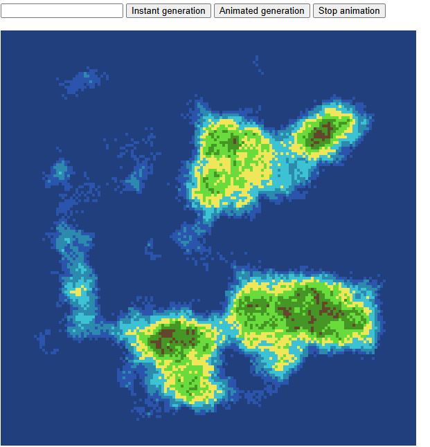
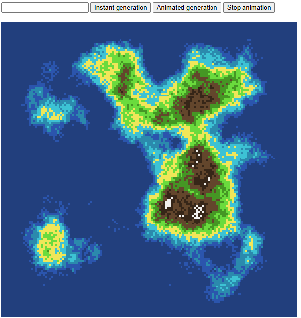

# 🎓 Проект

## 👤 Информация
**Имя и фамилия:** _Имя Фамилия_  
**Название проекта:** _Название проекта_

---

## 📌 Описание проекта

Опишите здесь ваш проект.  
Укажите:
- Что делает проект
- Чему научились в процессе разработки

---

## 🚀 Функциональность
- Функция 1
- Функция 2
- Функция 3

(Если список функций не нужен — можно удалить этот раздел.)

---

## 🛠️ Используемые технологии
| Технология / Инструмент | Назначение |
| - | - |
| Пример: JavaScript | Основной язык разработки |

---

## 🖼️ Скриншоты

  
  

---

## 📞 Контакты

###  🌐 <a href="https://easypro.academy/" target="_blank">easypro.academy</a>

### 📱  <strong>+7 (499) 283-17-14</strong>

&nbsp;&nbsp;&nbsp;

